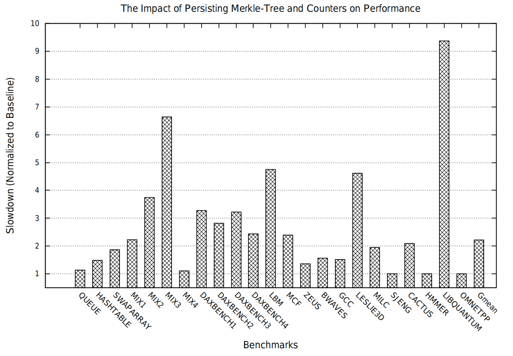

# [Triad-NVM: Persistency for Integrity-Protected and Encrypted Non-Volatile Memories](https://ieeexplore.ieee.org/stamp/stamp.jsp?tp=&arnumber=8980320)

本文研究了在内存加密和完整性验证的系统中如何设计持久化机制。

## 背景与问题：

非易失性内存（non-volatile main memory，NVMM）具有掉电数据不丢失的特性，同时也产生了在上电阶段（boot episode）数据被窥探或篡改的安全隐患。为了解决这一问题，即保证数据的保密性和完整性，需要使用加密算法和完整性验证算法，实现这安全性算法的数据成为安全元数据（本文中包括encryption counter， Bonsai Merkle Tree（BMT）和 message
authentication code（MAC））。

现有研究通常将内存安全与持久化分开来研究，而忽视了相互之间的影响。实际上，如果仅保证数据的持久化，而没有正确的持久化安全元数据，会导致系统崩溃恢复后无法通过安全元数据解密而恢复数据。
**问题在于**，如何同时实现数据安全保护，快速的崩溃/重启后的数据恢复和低延迟的数据及安全元数据的持久化。

## 研究动机：安全元数据的崩溃一致性机制对NVMM的性能影响
    

图 1 持久化安全元数据的性能开销

 

## 设计：
### 威胁模型：

## 实验：
GEM5(fs)， PMDK

## 新颖性： 
在混合内存架构下，结合了安全性和持久化提出了新的问题，并通过实验数据educate读者。

