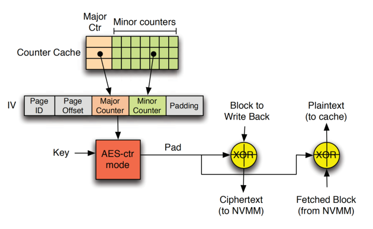
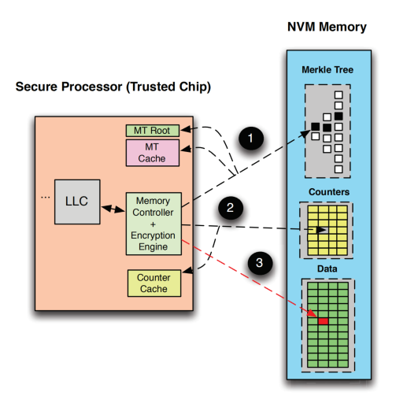

# [Triad-NVM: Persistency for Integrity-Protected and Encrypted Non-Volatile Memories](https://ieeexplore.ieee.org/stamp/stamp.jsp?tp=&arnumber=8980320)

本文研究了在内存加密和完整性验证的系统中如何设计持久化机制。

## 背景与问题：

非易失性内存（non-volatile main memory，NVMM）具有掉电数据不丢失的特性，同时也产生了在上电阶段（boot episode）数据被窥探或篡改的安全隐患。为了解决这一问题，即保证数据的保密性和完整性，需要使用加密算法和完整性验证算法，实现这安全性算法的数据成为安全元数据（本文中包括encryption counter， Bonsai Merkle Tree（BMT）和 message
authentication code（MAC））。

现有研究通常将内存安全与持久化分开来研究，而忽视了相互之间的影响。实际上，如果仅保证数据的持久化，而没有正确的持久化安全元数据，会导致系统崩溃恢复后无法通过安全元数据解密而恢复数据。
**问题在于**，如何同时实现数据安全保护，快速的崩溃/重启后的数据恢复和低延迟的数据及安全元数据的持久化。

### 相关知识：counter-mode encryption

计数器模式加密算法如AES，使用IV（initialization vector）作为输入生成one-time pad(OTP)，如图1所示.然后当加密的数据块（ciphertext）到达处理器芯片会与加密的pad进行按位XOR计算以获得明文（plaintext）。计数器模式加密算法能够同时解码和访存，从而具有较高的性能，此外还具有较强的安全性，能够防止dictionary-based attacks, known-plaintext attacks, 和 bus snooping attacks。                                                   

计数器模式加密算法存在多种可能的计数器格式，包括单调和分离式计数器。单调计数器（如Intel SGX）作用于全局内存块，并在每次写回内存时递增计数器的值以避免计数器复用。当单调计数器溢出时需要为所有密文重新执行加密操作，开销巨大。因此通常使用较大的计数器（64bit）避免溢出。然而，较大的计数器需要较大的片上（计数器）缓存。另一种分离式计数器由major（由内存页中的多个cacheline共享）和minor计数器组成。

图 1 最新的分离式计数器模式加密算法[参考论文]()

 
## 研究动机：
### 安全元数据的崩溃一致性

图 2 持久化安全元数据的实现，[参考论文](https://cfwebprod.sandia.gov/cfdocs/CompResearch/docs/main7.pdf)

 

### 安全元数据的崩溃一致性（crash consistency）机制对NVMM的性能影响
    
图3说明了在对安全元数据据页进行崩溃一致性保护时的系统吞吐率相比没有对安全元数据进行保护时的下降情况（最严重的的性能下降高达9.4X）。性能下降的原因是为了持久化安全元数据产生了额外的写操作。

由于持久化安全元数据会带来较大开销，许多用户放弃对其进行崩溃一致性保护，但是这样做会导致系统存在安全漏洞或数据无法在崩溃后恢复。

为了解决这一问题，本文定义了安全持久系统的要求，并研究了不同方案对系统性能、恢复时间和恢复能力的影响。 

图 3 持久化安全元数据的性能开销

 

#### 崩溃一致性： A backup or snapshot is crash consistent if all of the interrelated data components are as they were (write-order consistent) at the instant of the crash. To better understand this type of consistency, imagine the status of the data on your PC’s hard drive after a power outage or similar event. A crash-consistent backup is usually sufficient for nondatabase operating systems and applications like file servers, DHCP servers, print servers, and so on.

## 设计：
### 威胁模型：

## 实验：
GEM5(fs)， PMDK

## 新颖性： 
在混合内存架构下，结合了安全性和持久化提出了新的问题，并通过实验数据educate读者。

