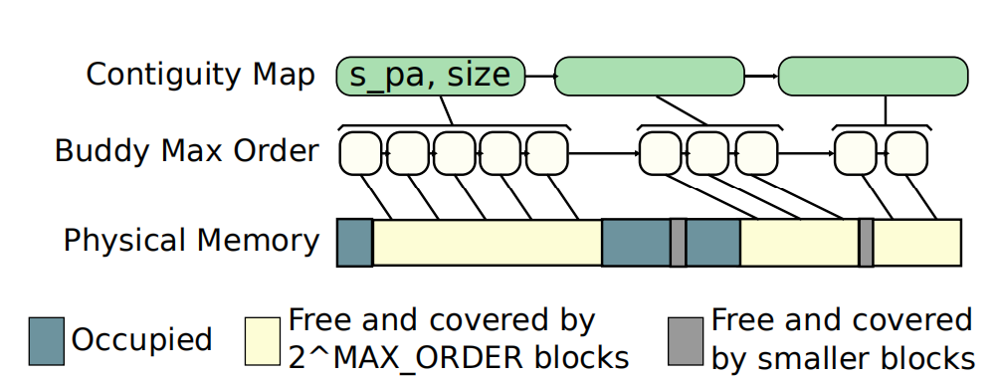

# [Enhancing and Exploiting Contiguity for Fast Memory Virtualization](https://conferences.computer.org/isca/pdfs/ISCA2020-4QlDegUf3fKiwUXfV0KdCm/466100a515/466100a515.pdf) 

本文研究了在虚拟机场景下的内存地址转换的开销问题

## 背景和问题：
随着计算机内存容量的增加，有限大小的TLB缓存会更频繁地发生miss，一旦TLB miss，就需要通过MMU硬件去内存访问多级页表，这会带来很高的延迟。
而在虚拟化场景下，需要两层地址转换，导致内存地址转换开销高达本地执行的6倍。
图1是在虚拟化场景下的地址转换示意图，客机操作系统的虚拟内存地址要通过客机操作系统的页表转换成客机物理地址，然后再通过hypervisor的页表转换成主机的物理地址。

图 1  虚拟化场景下的内存地址转换

每当TLB miss时，需要查询页表，获取物理地址。这一问题在虚拟化场景中更为严重。
以图2为例，要查询每一级客机操作系统的页表，都需要先去主机页表进行一次页表遍历，获取那一级客机页表的起始地址，然后用gVA找到相应的条目，这样算下来，对于一共需要访问24次内存。

图 2  虚拟化场景下的页表遍历

本文旨在降低虚拟化场景下的内存地址转换开销。

### 背景补充： Buddy allocator
为了避免内存外部碎片化（空闲内存分散成小块并且零散的分布，导致虽然内存的空闲空间足够，但无法为较大尺寸内存对象分配内存的现象），buddy allocator将物理内存分成11个分组，即order0 ~ order10,组分别包含大小 1，2，4，8，16，32，64，128，256，512 个连续物理页,如图3（b）所示。
内存分配会从大于所需空间的最小分组（假设是orderX）中获取空闲空间，
如果这个orderX分组中没有可用的空闲内存，那么会从orderX+1的分组中获取内存空间，并将获取的内存一分为二，切分之后的两个大小为才能块互为buddy。其中一个子块用于分配，另一个存放到orderX分组中。当这个内存对象被释放之后，会检查它的buddy是否也是空闲的，如果是，那么这对buddies将会被合并，即将orderX分组内的buddy内存块和当前被释放的内存块合并后存放到orderX+1分组中。

## 相关工作：

本文比较了最新的大页映射研究（软件），如图表1所示
Direct segment使用分段技术，将一个主要的VMA映射到一段连续的物理区域，并禁用这个VMA的paging机制。问题在于，这一段物理内存在应用被终止前不允许被回收。
Eager paging采用提前分配内存的方式，但是会导致内存膨胀并且会因内存碎片化而无法生成大尺寸的物理页。
Translation ranger利用后台守护进程定期扫描进程的VMA，通过迁移物理页来生成连续的物理大页。其问题在于会推迟一个应用生成大页的时机，并且页迁移同样会给内存访问增加延迟以及触发TLB shootdown。

表 1  软件机制相关工作

硬件设计方面，现有设计在虚拟化场景下因为设计复杂或存在对齐限制变得低效或者成本过高。
Direct segment将boundary存放在特定寄存器中，并且没有对齐限制，但是不支持多种映射粒度。
RMM设计过于复杂，每个处理器需要一个range TLB,每个进程需要一个range table，还需要硬件range table walker。
TLB coalescing将连续页映射合并成一个大页映射并存放在TLB中，合并的映射条目存在对齐的限制。
以上机制在虚拟化场景中，需要为每个虚拟机和客机操作系统分别维护多个虚拟的硬件结构和元数据，开销很大。
在虚拟化场景下，RMM和TLB coalescing需要记录的元数据信息增多且需要额外增加硬件设计（具体细节参考原文），开销过大。

表 2  硬件机制相关工作

## 设计：

<!-- *设计目标：*  解决现有大页映射的软硬件设计存在的问题，即避免内存膨胀，保留按需分配的灵活性，不受地址对齐的限制，在page fault时立即分配大页并避免在分配之后物理页迁移的开销，以及通过避免追踪物理和虚拟区域的边界减小硬件设计的复杂度。 -->
本文设计分为软件设计（CA paging）和硬件设计（SpOT）。

### *CA paging*

#### 研究动机
大页映射能够通过减少PTE条目数量提升TLB缓存效率，从而降低地址转换开销。但是现有大页映射机制处于两个极端，一种是在第一次访问VMA时才为其按需分配物理内存，但是分配的物理内存是随机的，从而导致内存外部碎片化问题，减少了系统后期生成大页映射的机会。另一种采用预留的方式提前准备好大段连续内存，这种方法缺乏内存分配的灵活性并在内存碎片化严重时难以发挥作用。
#### 设计思想
为了平衡上述两种极端，在保留内存分配的灵活性的同时避免内存碎片化，本文提出CA paging，
基于现有的按需分配策略（demand paging），在分配物理内存时有选择的将连续的物理空间分配给VMA。

此外，为了减少元数据开销，用连续内存页映射中虚拟和物理内存地址的差值（称为offset）代替内存边界和地址。

#### 元数据

CA paging共使用两种元数据：Offset和Contiguity map。
如图3（a）所示，一个VMA可能映射到多段连续的物理内存空间，offset是每一段连续内存映射中物理起始地址与虚拟起始地址的差值。

如图4所示，Contiguity map基于现有buddy allocator，记录了系统内存当前的所有空闲连续物理内存段,称为cluster，这个map记录了每个cluster的起始物理地址和大小，并且这些cluster不受对齐和大小的限制。此外，为了避免在每次更新contiguity_map时的搜索操作，在属于一个cluster的4KB物理页的page结构体中记录了指向这个cluster的指针。

图 3  CA paging元数据-offset

图 4  CA paging元数据-contiguity map

#### 具体机制

如图5所示，
当一个VMA被第一次访问时，发生第一次page fault，为了避免随机分配物理内存段导致的碎片化问题，CA paging用VMA的大小作为key查询contiguity map, 找到最合适的的内存段分配给当前VMA。**CA paing并不会为整个VMA分配物理内存，而是仅为当前被访问而发生fault的区域分配相应的内存（如图5中红色的页）。**
当同一个VMA在下次发生fault时，就可以通过已经记录的offset和当前发生fault的虚拟内存地址计算出目标物理页，再通过检查目标物理页的反向映射信息判断其是否空闲，若空闲，则这段大页映射的尺寸可以增加。如果发现目标物理页被占用（图5中黑色的页），并且page fault的区域大于4KB，那么CA paging会为剩余因第一次访问而发生fault的区域分配另一段连续的物理内存，并为这段新的连续内存地址映射记录新的offset。

为了避免同一个物理内存区域被不同的进程或VMA争用，采用next-fit策略，即在为下一个请求分配物理内存的时候，会最后考虑使用上一次使用过的区域，如图5⑤所示。 
此外，为了防止内存碎片化，会进行类似于buddy allocator一样的合并。最后，在虚拟化场景中，本文为两个维度（主、客机操作系统）的地址转换分别实现了一套独立的CA paging机制。

图 5  CA paging执行逻辑

### *SpOT*
   
为了加速在虚拟化场景下的地址转换，本文提出了硬件设计SpOT。
#### 研究动机
本文发现现有硬件设计（RMM，TLB coalescing）在虚拟化场景下元数据开销高或者性能差是因为需要对页映射的虚拟和物理边界进行记录或存在地址对齐的限制。 

#### 设计思想
SpOT用二维地址映射中gVA和hPA之间的offset代替其他元数据（如边界信息），并通过预测机制直接计算物理地址（可能不正确，需要将计算结果与实际查询页表的结果比对），而不是缓存一个确定的物理地址，从而消除了地址对齐的限制。

预测机制基于以下假设：
指令的访问具有局部性，大部分的TLB miss仅仅是由某几个指令导致的，即假设某内段存的访问与某几个指令直接相关。
因此**可以将程序计数器PC和某段VMA绑定，并假设所有VMA都只有一个offset，从而通过发生page fault的虚拟地址和offset推测出物理地址。**
#### 具体机制
SpOT的核心是一个预测表，记录了对应于PC的二维映射的offset和访问许可（图6（a）），通过程序计数器PC来索引和比较预测是否命中。

当执行某个指令第一次发生TLB miss时，程序会被挂起，直到查询完page table，SPOT会记录这个PC和发生fault的offset。
当下次再次执行同一条指令的时候，SPOT直接用offset预测出要访问的物理地址，然后执行操作，后台会并行地查询页表，并检查预测的正确性，如果发现结果相同，意味着预测命中，从而隐藏了page walk的开销（图6中的绿色部分）。
如果预测失败，就需要用正确的物理地址重新执行这条指令（图6中的红色部分）。

图 6  SpOT执行逻辑

## 实验：

基于Linux kernel 4.19修改， 用QEMU/KVM 2.1.2实现虚拟化环境，并用badgetrap来仿真硬件设计

[源码链接](https://github.com/cslab-ntua/contiguity-isca2020.git)