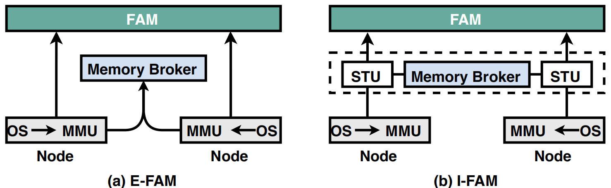
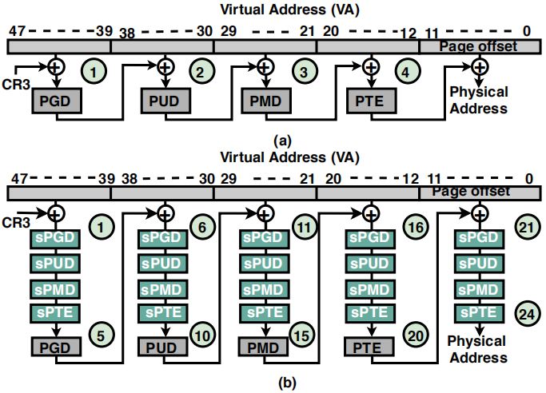
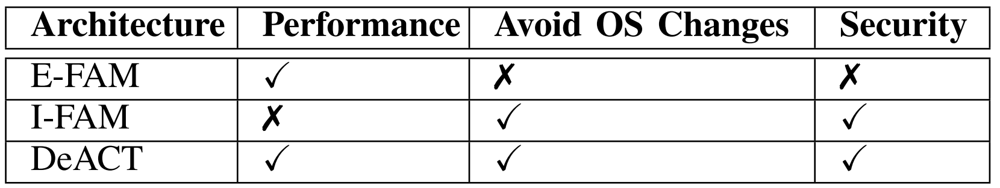
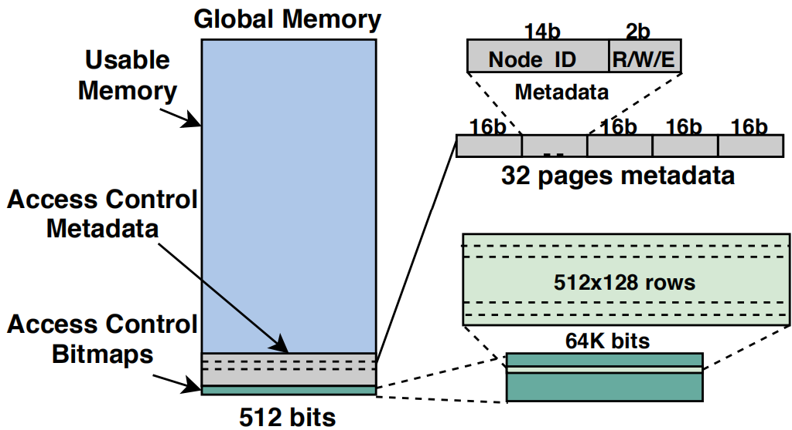
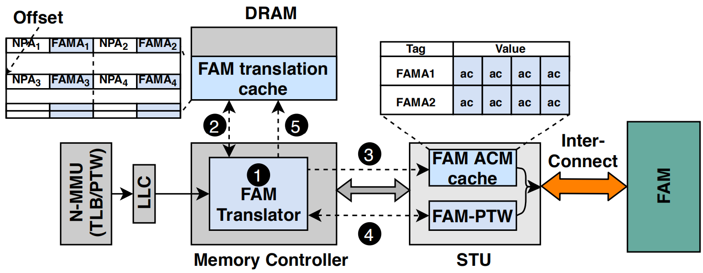

# [DeACT: Architecture-Aware Virtual Memory Support for Fabric Attached Memory Systems](https://arxiv.org/pdf/2008.00171)

本文针对异构内存系统提出了低开销的透明访问控制和地址转换机制,无需修改内核和应用。

## 背景和问题：

最近工业界热门的内存架构（称为memory-centric architectures）是将内存模块与计算节点分离，使计算节点可以访问多个内存节点，从而增加计算节点的物理内存容量，以满足现代应用对内存的需求。这样的例子比如，Facebook的分布式Rack，HPE实验室的*The Machine*,因特尔的Rack Sack。 
这种架构的优势在于高性能、灵活、低成本。

另一方面，实现内存语义协议并可以轻松与系统集成的内存模块被称为Fabric-Attached Memories（FAM）。FAM为HPC中的计算节点提供了通过快速互联访问共享物理内存池的能力。
在HPC系统中，将FAM应用到memory-centric architectures的内存节点可以使计算节点通过快速互联和已定义好的协议访问大容量的FAM池（包含多个相互独立FAM节点）。

在上述的memory-centric architecture架构中，如图1（b）所示，有两种方式实现对FAM节点的访问控制。一种方法是铜鼓偶一个memory broker节点将所有FAM节点的的物理内存抽象成一个整体，类似于虚拟机的二维地址转换，计算节点访问由memory broker节点提供的抽象后的地址，然后通过memory broker转换成FAM节点的物理地址。I-FAM的优点在于

[Kevin Lim等人](https://web.eecs.umich.edu/~twenisch/papers/isca09-disaggregate.pdf)在2009年探索过

**问题在于**，

图 1  两种FAM架构

图 2  虚拟化场景下二维页表查询

表 1  FAM架构对比

## 设计：
**设计思想：**
根据上述观察，本文基于E-FAM架构，将访问控制和地址转换解耦，在计算节点内的本地内存中缓存未经检验的地址转换信息，同时在系统级别（STU单元）执行访问控制。

1. *访问控制* ：
访问控制信息记录在FAM的特定区域（称为ACM）中，ACM的地址事先注册在STU中。

图 3  内存页访问控制

2. *加速地址转换* ：

图 4  DeACT地址转换流程

## 实验：
用[Structural Simulation Toolkit (SST)](http://sst-simulator.org/)仿真DeACT，
用[Opal](https://www.semanticscholar.org/paper/Opal%3A-A-Centralized-Memory-Manager-for-Memory-Kommareddy-Hughes/1447cc5b2f8cb33a76bc54bc9572e419eefe46ad) 分布式内存模型和内存管理器模拟系统

