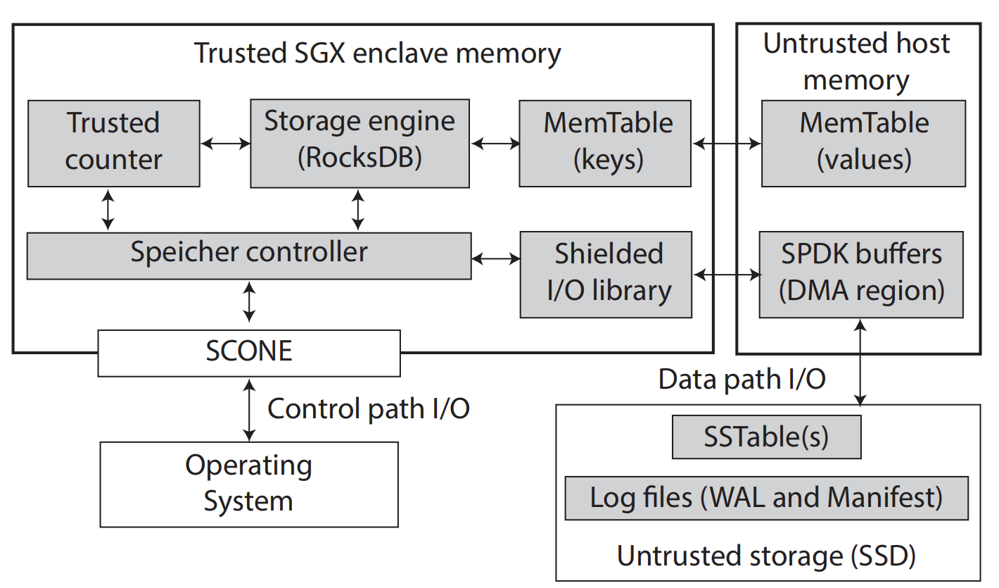

# [SPEICHER: Securing LSM-based Key-Value Stores using Shielded Execution](https://www.usenix.org/system/files/fast19-bailleu.pdf)
本文将基于SGX的可信执行环境延伸到包含不可信二级存储（如SSD、HDD）的范围。

## 背景和问题：
随着云计算的普及，现代在线服务普遍使用持久化KV store以可靠且高效地存储数据。但是对于第三方云计算基础架构来说，存储系统的安全漏洞经带来的风险页不断增加。而保护一个存储系统却很困难，因为存储系统有复杂的的IO栈以及云环境下，存储节点由不可信的第三方提供。

为了应对以上情况，可信执行环境（TEE），比如Intel的SGX和ARM的 TrustZone,为构建安全存储系统提供了一种方式。它们提出的的受保护的执行环境（shielded execution）旨在通过硬件提供强安全保障。

**问题在于**，可信执行环境的保护范围受限（SGX enclave page cache只有128MB），并且可信执行环境只能保护内存中的易失性计算和数据，无法保护第三方提供的持久化存储器。**即需要找到一种方法将可信执行环境延伸到不可信第三方持久化存储器。**

### 背景补充：*Intel SGX 和 受保护的执行环境*
Intel Software Guard Extension (SGX)是一组用于TEE的X86指令集扩展。SGX提供了一个名为enclave的硬件保护的内存区域，CPU能保证在这片区域内的数据和代码的保密性和完整性。enclave位于SGX enclave page cache（EPC）的大小。由于EPC的访问粒度是64B，为了限制存储和处理安全机制的元数据带来的空间和时间开销，EPC的大小被限制在128MB。

## 设计：
### 设计目标：
基于受保护的执行环境构架一个安全的存储系统，以达到保密性（未授权的实体无法访问数据）、完整性（能探测出未授权的数据更改），新鲜性（能检测出旧版本的数据）。

### 设计挑战：
本文设计部分需要解决的三个**设计挑战**是：1）第三方提供的存储介质不可信且EPC大小受限，需要将基于SGX的可信执行环境延伸到包含不可信的非易失存储节点。2）由于执行系统调用需要通过上下文切换退出enclave，开销很高，因此需要为受保护的执行环境设计一个direct IO 库消除数据路径中昂贵的上下文切换。3）为了防止rollback攻击（重放旧的系统状态）或forking攻击（创建第二个实例），需要重新设计一个及时更新的单调计数器。

**设计：**

如图1所示，系统包括控制器，直接IO库，单调计数器，RocksDB和安全LSM数据结构（Memtable，SST，Log）。

控制器为客户端提供远程认证服务。

图 1  SPEICHER 概览

## 实验：
本文基于[SCONE](https://www.usenix.org/system/files/conference/osdi16/osdi16-arnautov.pdf)受保护执行环境框架和RocksDB实现