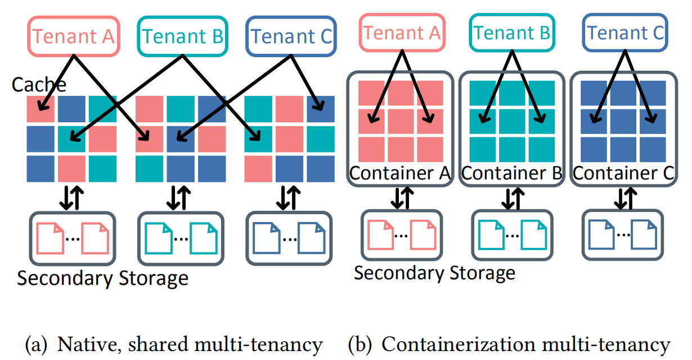
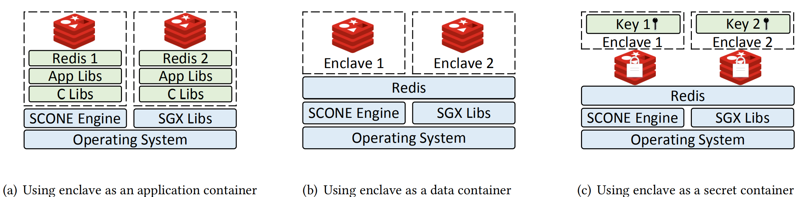
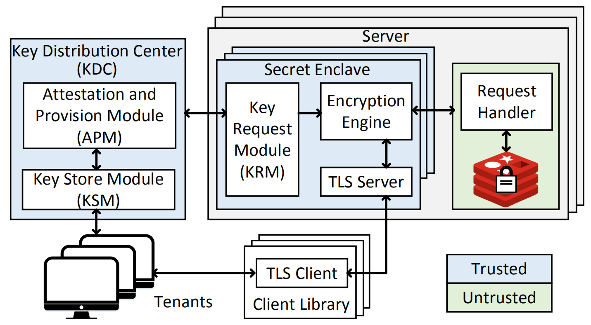

# [EnclaveCache: A Secure and Scalable Key-value Cache in Multi-tenant Clouds using Intel SGX](https://dl.acm.org/doi/10.1145/3361525.3361533)

本文提出基于Intel SGX的云环境多租户下的高性能租户间安全隔离机制。

## 背景和问题：

在内存KV（Key-Value） 缓存如Memcached和Redis被广泛用于加速网页应用和降低后端数据库压力。
许多大型网页服务提供商，比如Facebook和Twitter，构建了大规模缓存集群用以支持他们需要处理的巨大负载。而小型公司则采用了缓存即服务（caching-as -a-service）的方案在云环境之上部署自己的缓存系统，诸如Amazon ElastiCache,Redis Labs和Memcachier。

在云环境下，云提供商能够完全控制用户数据，这可能会使用户数据面临安全风险，原因有二：1）在多租户环境下，一个用户的敏感数据可能会暴露给其他共存的恶意租户。有研究表明，恶意租户可以使用各种各样的旁路攻击从共存的受害租户中提取敏感数据比如私钥。2）云平台供应商本身是可能存在安全漏洞。

**传统缓存管理策略无法有效解决上述安全问题**：一方面，对于多租户相关的安全问题，大多数云缓存供应商采用虚拟化或容器化技术。如图1（b）所示，Redis为每一个租户生成一个缓存实例并使用容器或虚拟机作为隔离层将不同的租户缓存分离开。但是这种方法会降低系统的可扩展性。与图1（a）的共享缓存机制相比，容器化机制产生的多个缓存实例会争抢资源从而导致性能下降，并且随着租户数量的增加，部署、监视和维护每个缓存实例的难度会迅速增加。另一方面，为解决云用户与云提供商之间的信任问题，已提出许多机制，比如，CryptDB和MONOMI采用*特性保留加密*以启用对加密数据的查询处理。但是这些机制会带来较高计算开销和信息泄露。

图 1  多租户云缓存机制

近年来一些研究人员尝试使用可信硬件，如Intel SGX为运行在云上的应用提供安全保护。SGX提拱的可信执行环境（Enclave）能阻止包括（主机）操作系统在内的特权系统代码的访问。已有的研究比如Haven，SCONE,Graphene-SGX允许未经修改的应用安全地运行在云环境中。**现有基于SGX的机制需要将完整的应用和一个库操作系统或libc库放进enclave内**，这样做会带来两个问题：1）导致较大的[可信计算库](https://en.wikipedia.org/wiki/Trusted_computing_base)（trusted computing base，TCB），从而增加系统安全风险的概率；2）SGX的大小有限（128MB），不足以将完整的KV缓存应用都存放入enclave内，当要通过SGX安全的访问位于enclave以外的数据时，要先将一些内存页面从enclave内交换出去，然后将要读取的数据映射到被交换出去的enclave内存页面。这一过程（称为EPC paging）涉及到加解密、完整性验证、内存映射更新和TLB shootdown等步骤，开销很高。

## 研究动机：选择将一个租户的哪一部分数据放进enclave内以防止其他租户的攻安全攻击。

图 2  不同的基于enclave的多租户缓存设计

如图2所示，有三种不同的基于SGX enclave的安全多租户缓存隔离方案，本文对每一种进行了分析以确定哪一种能最佳地解决上述问题。

- Apllication Enclave: 如图2（a）所示，租户在应用级被完全隔离，每个租户有独立的基于enclave的容器，整个KV 缓存应用和依赖库都运行在对应租户的容器内。这样的设计有SCONE。这种设计具有最佳的隔离性，但是其安全和可扩展性并不好。从安全角度来说，由于将整个应用和所有依赖库放进了enclave，TCB增加，从而增加了安全漏洞发生的范围。从可扩展性方面来说，系统要为每一个租户维护一个独立的软件堆栈，包括Redis实例及其依赖库、libc库，导致资源竞争和维护开销增加。
  
- Data Enclave: 如图2（b）所示，由于所有的租户都可以共享enclave内的软件堆栈，只有租户的私有数据需要安全隔离，因此相比于保持原有应用程序不变，第二种方案实现了一个自定义缓存应用程序，该应用程序使用enclave仅将各租户的私有数据进行隔离。因为只需要一个redis实例，这种方案的可扩展性较好。但是租户的数据量可能会超过enclave的大小，从而需要使用开销很高的EPC paging。
  
- Secret Enclave: 第二种方案存在租户数据量要小于enclave中可使用的内存容量的限制。为此，提出第三钟方案进行优化：仅在每个enclave内存放相应租户的敏感数据和关键代码以减少enclave内存占用。如图2（c）所示，每个租户有一个专有的enclave，租户将一个特有的加密秘钥存放进自己的enclave内，用于对租户的数据进行加解密。租户的数据可以加密后存放在enclave外。
  
基于上述分析，本文采用secret enclave方案以保证高性能和较高的租户间安全隔离性。

## 设计：

图 3  EnclaveCache架构

### EnclaveCache架构:
  
如图3所示，每个最后通过clinet library连接到一个专有的secret enclave。网络纯属的保密性由TLS保证。Encryption Engine负责加密来自TLS server的请求并转发给Request Handler。Encryption Engine使用的encryption key由KRM从KDC中获取。KDC运行在一个具有SGX保护的平台上，由APM和KSM组成。KSM用于阻止对租户的的encryption key的非法访问。

## 实验：
基于真实的硬件平台实现：

**EnclaveCache:** SGX-capable Intel Core I7-7700K 处理器

**客户端机器:** Intel Xeon server
