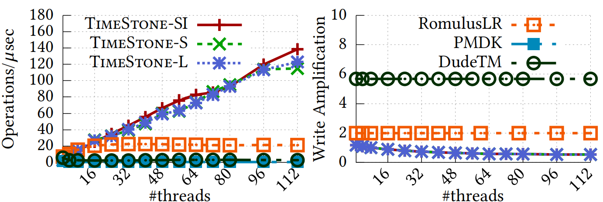
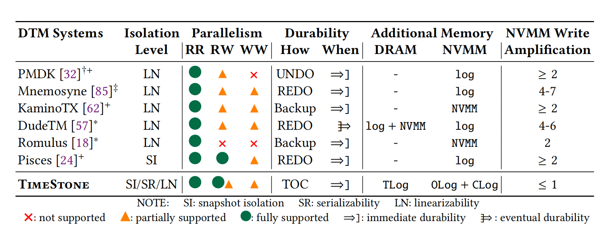
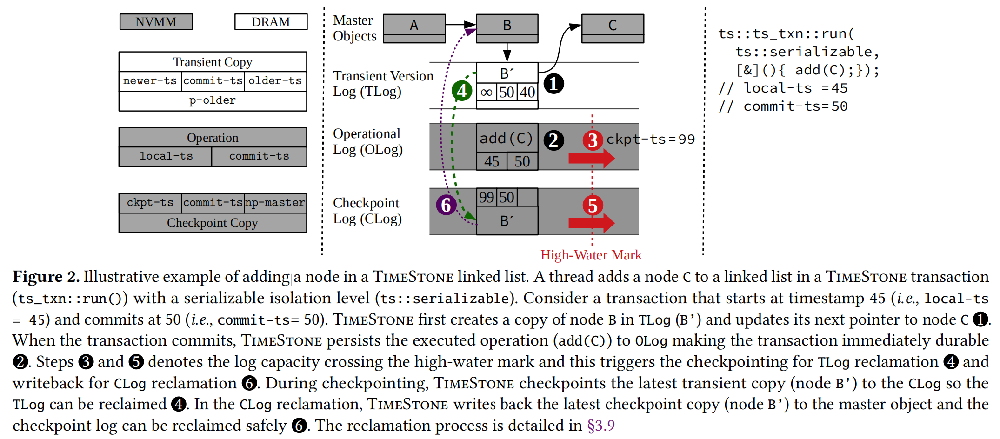
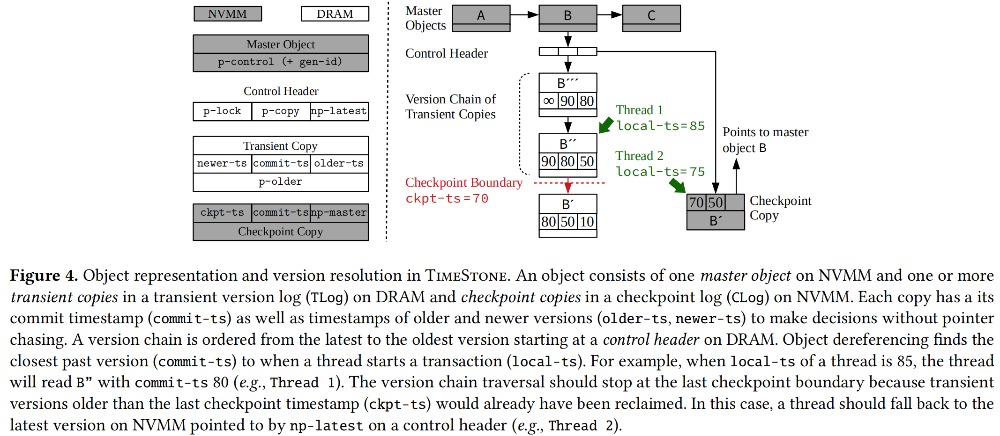

# [Durable Transactional Memory Can Scale with TimeStone](https://dl.acm.org/doi/abs/10.1145/3373376.3378483)
本文在持久化事务内存场景下优化了MVCC的写放大。
## 背景和问题：

持久化内存技术（如Intel Optane）具有传统内存的特性（如字节可寻址能力和第访问延迟）的同时还提供了持久性和大内存容量。这使得软件能够完全驻留在内存并且保证数据掉电不丢失。

持久化内存也为系统开发人员带来了新的挑战，由于持久化内存具有掉电不丢失、编程次数有限的特性，在设计持久化内存软件时，需要保证数据的崩溃一致性，并尽可能降低写放大。
持久化内存有望很快成为数据中心多核服务器的一部分，在设计基于持久化内存的软件时，多核可扩展性是一个重要的衡量指标。因此，一个具有竞争力的持久化内存库应该在保证数据的崩溃一致性的同时提供高性能，多核可扩展性，以及最小写放大。

**问题在于，现有研究无法同时达到以上设计要求。**

图 1  DTM系统性能比较

### 相关工作：

现有针对数据崩溃一致性的研究可以分为两类：

一类是并发持久化数据结构（concorrent durable datya structure, CDDS）。它们利用应用程序的数据结构知识来实现更好的可扩展性，但他们无法对组合操作提供原子性（例如原子性地更新一个链表的两个节点），此外，现有CDDS库仅支持元数据的一致性，而不支持数据的一致性，存在系统掉电导致数据丢失的风险。CDDS的这两个局限导致CDDS库的实用性较差。

另一类是持久化事务内存（durable transactional memory, DTM）。它们通过事务封装为组合操作提供了原子性，并为元数据和数据都提供了一致性。然而实验表明，现有DTM设计的可扩展性不超过16核(如图1所示)，并且写放大严重（2-7倍）。
如表1所示，现有DTM研究无法同时满足性能，可扩展性和低写放大的要求。
DudeTM和Memosyene基于STM，而STM本身的可扩展性差。此外，他门设计的数据一致性机制会引发较高的写放大。Romulus和KaminiTX通过维护了一个完整的持久化内存的副本最小化写放大，但是这种做法降低了持久化内存的成本效益。此外，现有DTM的写并发性较弱，从而导致可扩展性不佳。Piseces针对可扩展性进行了优化。但是它只支持事务的快照隔离（snapshot isolation），不支持可串行性（serializabilty）隔离和线性（linearizability）隔离，从而降低了实用性。此外，Pisces提出的双版本并发控制和日志回收时的同步写会降低DTM的可扩展性并增加写放大。

表 1  DTM系统性能比较

## 设计：

**设计思想：**
通过MVCC提供多核环境下的可扩展性并使用DRAM暂存多个版本的日志，并定期仅将最新的日志版本写入持久化内村，从而减少了持久化内存的写放大。

1. *Multi-Versioning*
   
MVCC通过创建一个新的新版本来进行数据对象的异地更新，该版本是原对象的一个完整副本，提供了数据一致性。此外，MVCC维护的多个版本相互隔离，可以支持不同程度的事务隔离。

因此，本文为了支持更高的并发性，即读-读、读-写和写-写并发并且支持不同程度的事务隔离，采用MVCC(多版本并发控制)。但是MVCC本身存在写放大的问题，会加速持久化内存的磨损。

图 2 timestone执行逻辑示例

2. *TOC Logging*

为了优化MVCC带来的写放大问题，本文提出TOC logging。
本文提出的log是一个分层结构，共三层，第一层T log放在DRAM，记录对原有master object的更新，checkpoint时只写回最新版本，用于减小写放大，第二层O log用于持久化新添加的数据，放在NVMM中，C log也放在NVMM中，用于崩溃恢复，存放checkpoint时对原有master object的最新版本，通过master object可以对用户定义的多种数据结构提供事务支持
图2是对一个链表进行更新操作，如果要插入节点C，首先将要修改的节点B从NVMM拷贝到T log，更新B的尾指针指向C，并将C的数据持久化到O log，当O log容量达到阈值时，触发T log的checkpoint，T log中的最新版本写回C log，回收T log空间，当C log容量到达阈值，触发C log的checkpoint，将C log写回master object，并回收C log空间。
图3中对象B在DRAM中维护了一个版本链，在chekpoint时将当前最新的版本刷回NVMM，版本的时间戳用于同步并发的读写以及log回收时检测能否删除某一数据

图 3 timestone数据对象的多版本区分

   
3. *Timestamp Allocation*

本文使用硬件时间戳实现线程间同步，避免锁机制，进一步提高可扩展性。

## 实验：

Platform

真实持久化内存服务器(intel DCPMEM)

内存： 1TB NVMM and 337GB DRAM

处理器： 2.5GHZ 112core Intel Cascade Lake Processor