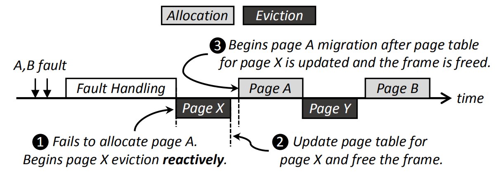

# [Batch-Aware Unified Memory Management in GPUs for Irregular Workloads](https://ramyadhadidi.github.io/files/kim-asplos20.pdf)
本文在统一虚拟内存架构下，针对随机访问负载（如图处理应用）优化了GPU内存的page fault机制。
##  背景和问题：

图 1  统一虚拟内存机制（右）

GPU已经成为服务器和数据中心中重要的计算平台之一。传统的分离式GPU只能访问其私有设备内存，可访问内存容量严重受限，既增加了软件开发的局限性（限制软件内存占用），也为处理内存占用超过几百GB的大规模应用增加了挑战（需要精细地设计数据和算法分区）和成本（仅仅为了增加GPU内存容量而购买更多的GPU）。

为了解决访问内存受限的问题，新型GPU支持统一虚拟内存（UVM）技术，UVM为CPU和GPU提供了统一的虚拟内存地址空间，数据能够通过请求分页（demand paging）机制自动地在CPU或GPU节点之间迁移，从而使得GPU能访问CPU内存。

**问题在于**，GPU在UVM下使用demand paging依赖于缺页异常（page fault），而缺页异常的延时非常高（20-50us）。
此外，GPU会比CPU更频繁地访问内存，进一步放大demand paging的性能影响。

### 相关工作：
发表在ASPLOS 2019上的一篇文章[A Framework for Memory Oversubscription Management in Graphics Processing Units](https://dl.acm.org/doi/10.1145/3297858.3304044)提出ETC框架，这个框架能够通过预测访问模式来选择使用哪种策略组合从而降低GPU内存的demand paging带来的开销。但是对于大规模随机的负载，ETC表现不佳：第一，ETC严重依赖于准确预测负载访问模式提前执行page eviction，但是对于随机负载，无法作答准确地预测。第二，ETC其中的一个机制memory-aware throttling旨在通过关闭一部分GPU核以减小负载的的工作集。然而实验表明，对于许多大规模随机负载，GPU核使用数量与应用的工作集大小没有直接关系。这是因为存在大量的GPU核内存共享。

因此本文针对大规模随机负载对GPU的demand paging机制进行优化。

## 研究动机（motivation）：

GPU为了摊销PCIe总线传输和异常处理系统调用的开销，每次处理多个page fault，即批处理。如图2所示，由于GPU CUDA架构存在很高的并行度，同时会有上百货上千个线程在运行，因此某一个时间段内会积累很多page fault请求。图中A,B,C，D为四批次page fault，page fault的处理时串行化的，page fault的处理分为预处理，查询内存页表（page table walk）和页迁移（page migration）：预处理过程需要给page fault排序、插入page prefething请求以及调度page evivtion；在执行完page table walk完成后，开始page migration。只有完成了A批次的page fault处理，才会执行后续的B，C，D。由于在处理A批次时，连续生成了B,C两个批次的page fault，当A处理完后，发现有B,C两个批次，GPU会同时处理所有累积的page fault。本文通过初步实验获得了一下重要结论：

1. 本文将page fault批处理划分为page fault handling和page migration两个阶段，第一个阶段的时间占比较大。

图 2  观察1：GPU以批处理的方式同时处理多个page fault

2. 如图2所示，实验发现，大多数批处理较小，且单次批处理越大，page fault的平均处理延时越低。

图 3  观察2：批处理越多，平均处理延时越低

3. 观察3：Page eviction位于关键路径。如图4所示，为了避免页B覆写正在被逐出的页X，page eviction策略选择将page eviction串行化。
   
  

图 4  观察3：page eviction位于关键路径。

 

## 设计： 

**设计思想：**
- Fault handling：通过提前执行上下文切换，使不同批次的page fault能够被交错地完成，相比于串行化不同批次的page fault处理，降低page fault平均延时；

- Page eviction：提前完成page eviction，从而将page eviction移除出page miration的关键路径。

设计：
1. Thread Oversubscription (TO)
通过增加批处理大小（一批次处理的page fault数量），有效地降低GPU平均page fault处理时间

图 5  thread oversubscription机制

 

  

图 6  thread oversubscription增加批处理大小原理

 

1. Unobtrusive Eviction (UE)
将page eviction移出关键路径（软件方法）

  

图 X unobtrusive eviction执行逻辑

 

## 实验：

实验平台：如下图所示，修改MacSim仿真器以仿真虚拟内存（TLB，页表，Page table walker），demand paging和VT。

图 X  仿真平台配置

