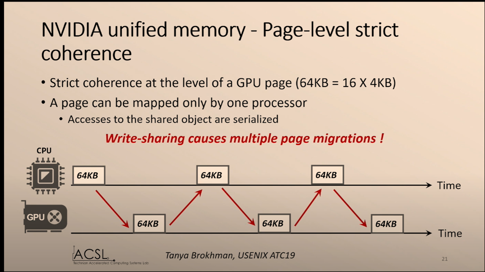
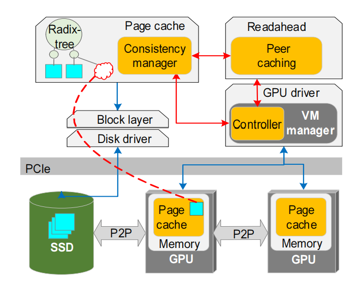

# [GAIA: An OS Page Cache for Heterogeneous Systems](https://www.usenix.org/system/files/atc19-brokhman.pdf)
本文提出GAIA，针对分布式多GPU架构的的弱一致性page cache，为GPU提供了mmap（）功能，将文件映射到GPU地址空间。

## 背景和问题：

GPU内存完全由GPU驱动管理，而没有主机操作系统（host OS）的参与。因此GPU 无法使用mmap（）接口高效地访问内存映射的文件，也无法针对CPU和GPU共享文件进行IO优化。因此需要需要将GPU内存更紧密地集成到OS page cache和文件I/O机制中。

将文件映射到GPU内存能带了许多好处：实现系统级别的性能优化，如为GPU内核实现预取和双缓存；文件内存也可以被CPU和GPU共享；而将OS page cache延伸到GPU内存能够将大尺寸文件缓存到GPU 内存，相比通过CPU访问SS能提升IO性能；最后，允许OS管理GPU的page cache能够避免污染CPU page cache。

然而现有相关工作并没有将GPU内存和OS page cache高度整合：[ActivePointers](https://dl.acm.org/doi/10.1145/3007787.3001200)提供了一个mmaped file抽象，但是需要修改GPU内核，使它们与闭源库(如CuBLAS)不兼容；NVIDIA UVM和[Linux HMM](https://www.kernel.org/doc/html/v4.18/vm/numa.html)允许CPU和GPU 访问共享内存，但是不提供mmap功能，并且限制一个物理内存页只出现在一个处理器地址空间中。

图 1  false sharing在UVM架构下导致一个页不断地在不同的处理器内存间迁移

## 设计：
这里只简述本文的主要挑战和GAIA page cache架构。
### 设计目标：
- map for GPU kernels（主）
- efficient write-sharing between CPU and GPU
- enable CPU and GPU I/O optimaizations

### 主要挑战：
- CPU 和GPU共享文件造成的一致性问题

### 重要观察：
**多处理器之间的false sharing在强一致性模型（NVIDIA UVM， Linux HMM）下会产生较高的开销。**

NVIDIA UVM和Linux HMM在GPU page的粒度下实现了严格一致性，一个页只能同时被一个处理器映射。当一个处理器要访问不在自己内存中的页时需要通过demand paging将页迁移到自己的内存中，而这个页会被映射到当前处理器并取消原始映射。

问题在于，当多个处理器访问一个页的非交叠部分（比如CPU和GPU分别访问一个页的前32KB和后32KB）时（称为false sharing），数据页会在访问这个页的处理器内存间来回迁移，造成严重的性能下降，如图1所示。

因此，本文page cache的一致性模型选择了弱一致性模型中的[lazy release consistency (LRC)](https://en.wikipedia.org/wiki/Release_consistency)。

### 设计思想：
根据上述观察，本文采用弱一致性模型（LRC）实现page cache的数据一致性。

### GAI架构：
图2展示了GAIA在OS kernel中的主要模块。分布式page cache跨越了CPU和GPU内存。
page cache内的consistency manager实现了LRC一致性模型。
consistency manager记录了每个file-backed page的版本号和位置。当CPU或GPU访问一个页时因为不在本地内存而产生page fault，consistency manager找到最新版本的数据，必要时会取得数据并做合并（因为一个数据可能被多个处理器更新不同的位置）。        
peer caching用于找到获取最新版本数据的最短路径并与预取机制整合。
为了能够正确处理GPU上的内存映射文件，GPU驱动程序中的GAIA controller跟踪系统中由文件支持的所有GPU虚拟地址范围。

图 2  在OS kernel内实现的GAIA架构（黄色部分为本文做出的修改）

</center

## 实验：

修改Linux kernel 4.4.15， CUDA SDK 8.0.34, NVIDIA UVM driver 384.59