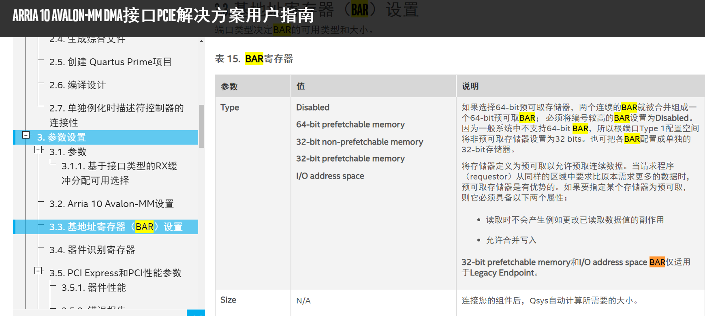

# PCIe MMIO资料整理

[PCIe BAR](https://zhuanlan.zhihu.com/p/26244141)

[Linux PCI Express配置空间读写内核实现](http://www.ilinuxkernel.com/files/5/Linux_PCI_Express_Kernel_RW.htm)

[PCIe原理](https://www.cnblogs.com/LoyenWang/p/14165852.html)

[老男孩读PCIe之六：配置和地址空间](http://www.ssdfans.com/?p=8210)

[PCI总线的桥与配置](https://example61560.wordpress.com/2016/06/30/pcipcie-%E6%80%BB%E7%BA%BF%E6%A6%82%E8%BF%B02/)

[64bitBAR配置](http://www.applistar.com/wp-content/uploads/apps/PCIe%20DMA%20User%20Manual.pdf)

## PCIe基础知识系列博客
[PCIe扫盲系列博文连载目录篇(第一阶段)](http://blog.chinaaet.com/justlxy/p/5100053251)

[PCIe扫盲系列博文连载目录篇(第二阶段)](http://blog.chinaaet.com/justlxy/p/5100053328)

[PCIe扫盲系列博文连载目录篇（第三阶段）](http://blog.chinaaet.com/justlxy/p/5100053481)

[PCIe扫盲系列博文连载目录篇（第四阶段）](http://blog.chinaaet.com/justlxy/p/5100057779)

[PCIe扫盲系列博文连载目录篇（第五阶段）](http://blog.chinaaet.com/justlxy/p/5100061871)
### 精选 （选自第二阶段）
[PCIe扫盲——基地址寄存器（BAR）详解](http://blog.chinaaet.com/justlxy/p/5100053320)

[来源](https://www.intel.cn/content/www/cn/zh/programmable/documentation/lbl1415138844137.html)

